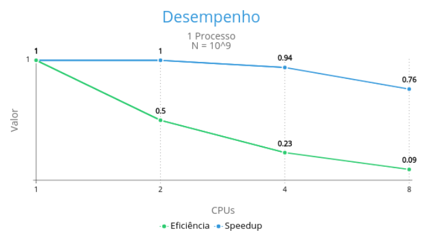
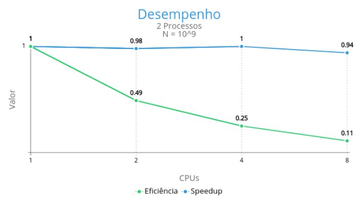
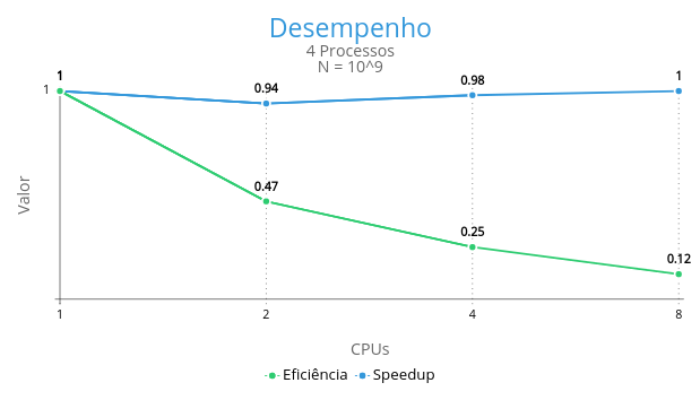
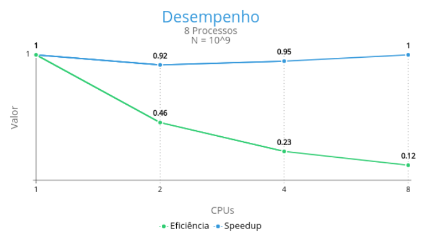

## Objetivos

- Paralelizar o programa **calcpi_seq.c** utilizando o padrão MPI
- Paralelizar o programa **montecarlo_pi.c** utilizando o padrão MPI

## Abordagem para calcpi_seq.c

A abordagem aqui é dividir a carga de trabalho do loop principal, onde estão sendo realizados os cálculos de aproximação da integral com o método do trapézio.

Para tal, dividimos o número de iterações N entre todos os processos. No caso dessa divisão não ser inteira deixamos as iterações excedentes com o processo de maior ranque.

Ao final do processamento, as somas parciais de cada processo são devolvidas ao processo raiz através de uma redução, que por sua vez mostra o resultado obtido.

## Avaliação de desempenho para calcpi_seq.c e calcpi_paralelo.c

Utilizamos a rotina definida no arquivo **timer.h** para medição de tempo da versão sequencial. Já o desempenho da versão paralela foi medido com a rotina **MPI_Wtime**.

Como os resultados de cada execução podem variar, utilizamos como referência a média dos valores obtidos com 3 rodadas, considerando todos os processos.

Executando o programa localmente em uma única CPU de 4 núcleos, obtemos a seguinte tabela:

| Precisão / Versão | Sequencial | Paralela - 1 processo | Paralela - 2 processos | Paralela - 4 processos | Paralela - 8 processos | Paralela - 12 processos | Paralela - 16 processos |
|-------------------|------------|-----------------------|------------------------|------------------------|------------------------|-------------------------|-------------------------|
| 10^9              | 3,382 s    | 3,238 s               | 1,638 s                | 0,839 s                | 0,846 s                | 0,824 s                 | 0,847 s                 |
| 10^10             | 33,986 s   | 33,347 s              | 16,732 s               | 8,627 s                | 8,589 s                | 8,776 s                 | 8,491 s                 |
| 10^11             | 336,967 s  | 333,379 s             | 170,059 s              | 89,580 s               | 86,993 s               | 86,485 s                | 87,040 s                |

Executando o programa no servidor via SSH, tivemos um aumento considerável do tempo de execução, porém foi possível traçar os gráficos de speedup e eficiência:

## Abordagem para montecarlo_pi.c

Como sabemos a priori o número de iterações necessárias, vamos utilizar a mesma abordagem anterior, dividindo a carga de trabalho do loop principal e juntando os resultados parciais no processo raiz através de uma redução.

## Avaliação de desempenho para montecarlo_pi.c e montecarlo_pi_paralelo.c

Utilizamos a rotina definida no arquivo **timer.h** para medição de tempo da versão sequencial. Já o desempenho da versão paralela foi medido com a rotina **MPI_Wtime**.

Executando o programa localmente em uma única CPU de 4 núcleos, obtemos a seguinte tabela:

| Precisão / Versão | Sequencial | Paralela - 1 processo | Paralela - 2 processos | Paralela - 4 processos | Paralela - 8 processos | Paralela - 12 processos | Paralela - 16 processos |
|-------------------|------------|-----------------------|------------------------|------------------------|------------------------|-------------------------|-------------------------|
| 10^9              | 18,97 s    | 38,49 s               | 19,50 s                | 13,67 s                | 11,38 s                | 11,34 s                 | 10,93 s                 |
| 10^10             | 189,58 s   | 384,13 s              | 193,11 s               | 109,09 s               | 108,58 s               | 114,98 s                | 110,45 s                |
| 10^11             | 2721,71 s  | 3852,92 s             | 1945,55 s              | 986,52 s               | 1037,65 s              | 1109,04 s               | 1063,41 s               |

Nota-se que a versão paralela com 1 processo apresentou maior tempo de execução que a sequencial. Acreditamos que seja algum overhead gerado pelo MPI.

Não foi possível executar os testes com múltiplas CPUs devido o SSH ter apresentado problemas com execução dos jobs nos últimos dias.
